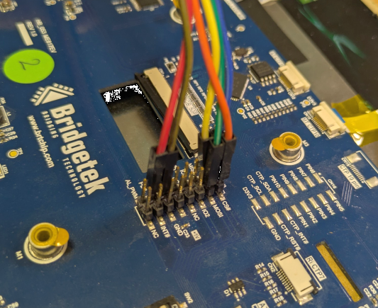
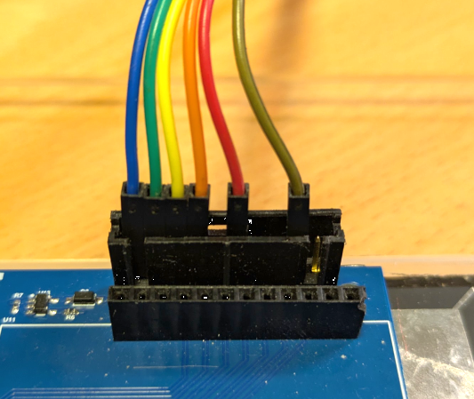
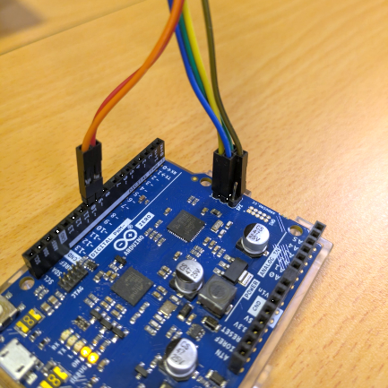

# Arduino Library for Bridgetek BT820

[Back](../README.md)

This library is to provide an API to control the Bridgetek BT820 devices. It implements EVE API 5.

The class name of the library is "Bridgetek_EVE5".

The library provides an Arduino IDE interface to the EVE embedded development library [EVE-MCU-Dev](https://github.com/Bridgetek/Eve-MCU-Dev).
It is programmed in the same way with minor changes and ensures that code is easily transferrable.

The example code is set to the WUXGA display resolution.

## Contents

- [Hardware](#hardware)
- [Using the Library](#using-the-library)
- [Programming Guide](#programming-guide)
  - [Library API](#library-api)
  - [Library Constants](#library-constants)
- [Examples](#examples)
  - [Arduino IDE Examples](#arduino-ide-examples)
- [Module Connections](#module-connections)
  - [Through-Board 2x8 Pins](#through-board-2x8-pins)
  - [Header 1x10 Pins](#header-1x10-pins)
  - [Arduino Connection](#arduino-connection)

## Hardware

The Arduino port was developed using an Arduino Zero and Arduino Leonardo. The Arduino module can be connected via short wires to the corresponding signals of an EVE module. Please reference the Arduino Datasheet for more information.

| Arduino Name | Arduino Pin | EVE Signal |
| --- | --- | --- |
| SCLK | ISCP 3 | SCK |
| COPI | ISCP 4 | MOSI |
| CIPO | ISCP 1 | MISO |
| D10 | PB6 | CS# |
| D9 | PB5 | PD# |
| - | ISCP 2 | 5V |
| - | ISCP 6 / GND | GND |

If using the 5V power from the Arduino ensure that the power supply from the Arduino module
is capable of also powering the EVE board. If using third-party modules which may consume
more current, a separate power connection to the EVE module could be used, with the grounds
of the Arduino and EVE modules common to both power sources.

## Using the Library

The library can be added to a sketch by including the lines in the example below. This example
is for the API 5 library for BT820,
the number corresponds to the API.

The sketch must include the following code:

```
#include <BridgetekEVE5.h>

Bridgetek_EVE5 eve;

void setup(){
  eve.setup(WVGA);
  eve.Init()
}
```

The `#include <BridgetekEVE5.h>` line will add in the header for this
library and the declarations and constants included in the library API.

The `Bridgetek_EVE5 eve` creates a class for the library which is required to direct
accesses to the EVE device to the library.

The `eve.setup(WVGA)` command initialises the library to use a WVGA display which is
800 by 480 pixels.

Finally, `eve.Init()` calls the library and initialises the SPI interface to the EVE
device and then configures the EVE device for use. Once this command is complete the
EVE device is usable for creating displays using co-processor commands via the library's
API.

Display lists can be generated through the co-processor in the same way as they are in
[EVE-MCU-Dev](https://github.com/Bridgetek/Eve-MCU-Dev), the display list entries and
  co-processor commands are added using calls to the library API.

## Programming Guide

The latest Programming Guide for the BT820 can be found on the
[Bridgetek Programming Guides](https://brtchip.com/document/programming-guides/) page.

This covers the command set implemented by the device and methods for acheiving the
desired output on the screen.

### Co-Processor Helpers

These functions perform the necessary tasks to begin and execute co-processor lists.

`void LIB_BeginCoProList(void)`

Puts Chip Select low and sends the starting address of the RAM_CMD location where the
commands will be written. Chip Select remains low.

`void LIB_EndCoProList(void)`

Brings Chip Select high to end the burst and ensures that the co-processor will execute
the newly added commands.

`void LIB_AwaitCoProEmpty(void)`

Waits for the completion of the current commands sent to the co-processor.

### Creating screens and executing commands

The API Layer provides functions to begin and end lists of co-processor commands. The co-processor
commands must be preceeded and followed by co-processor management functions.

#### Writing DL Instructions and Co-Processor Commands

Using EVE commands via the co-processor requires some data formatting to convert the parameters of the
command into the correct hex values to be sent as well as keeping track of the number of bytes sent to
update the write pointer correctly. Some commands also require padding to make their total size including
parameters a multiple of 4 bytes. The functions in the library hide this from the main application.

#### Beginning and Ending Co-Processor Lists

All co-processor lists must begin with a call to `LIB_BeginCoProList()`.
If any display list items or co-processor commands which use the display list are to be added then a
call to `CMD_DLSTART()` is required immediately after this.

For the avoidance of doubt, commands that only read or write registers, read or write memory, access
flash or access the SD card do not require the `CMD_DLSTART()` call.

All co-processor lists displaying graphics would be preceeded by:
```
    eve.LIB_BeginCoProList(); // CS low and send address in RAM_CMD
    eve.CMD_DLSTART(); // When executed, EVE will begin a new DL
```
And followed by:
```
    eve.LIB_EndCoProList(); // CS high
    eve.LIB_AwaitCoProEmpty(); // Wait for FIFO to be finish
```
A call to `LIB_AwaitCoProEmpty()` is implied in the call to `LIB_BeginCoProList()`. Therefore
it is not necessary to wait at the end of the co-processor
list for the completion of the commands allowing program to perform other tasks not related to
programming the EVE device.

#### Simple Co-Pocessor List

The following is a simple list to write text on the screen in white letters:

```
    eve.LIB_BeginCoProList(); // CS low and send address in RAM_CMD
    eve.CMD_DLSTART(); // When executed, EVE will begin a new DL

    eve.CLEAR_COLOR_RGB(0, 0, 0); // Select colour to clear screen to
    eve.CLEAR(1,1,1); // Clear screen

    eve.COLOR_RGB(255, 255, 255);
    eve.CMD_TEXT(100, 100, 28, eve.OPT_CENTERX | eve.OPT_CENTERY, "Hello");

    eve.DISPLAY(); // Tells EVE that this is the end
    eve.CMD_SWAP(); // Swaps new list into foreground buffer
    eve.LIB_EndCoProList(); // CS high and end list
    eve.LIB_AwaitCoProEmpty(); // Wait for FIFO to be empty
    // (commands executed)
```

#### Executing a Single Co-Processor Command

When just executing a co-processor command (for example calling CMD_SETROTATE during set-up
of the application to set the screen orientation) then the following can be used:

```
    eve.LIB_BeginCoProList(); // CS low and send address in RAM_CMD
    eve.CMD_DLSTART(); // When executed, EVE will begin a new DL

    eve.CMD_SETROTATE(2);

    eve.LIB_EndCoProList(); // CS high
    eve.LIB_AwaitCoProEmpty(); // Wait for FIFO to be finish
```

### Library API

This library functions provide an API for sending commands to the device and receiving results and
status from a sketch.

API calls in a sketch to this library call an equivalent function in the [EVE-MCU-Dev](https://github.com/Bridgetek/Eve-MCU-Dev) API.
Each API function in this library maps to a function with a prefix `EVE_` in the EVE-MCU-Dev library.
Therefore, taking `eve` as the name of the library class in a sketch, calling the function
`eve.CMD_SWAP()` will call the function `EVE_CMD_SWAP()` in EVE-MCU-Dev.

The full API available to the Arduino IDE is as follows:

```
int LIB_AwaitCoProEmpty(void)
uint16_t LIB_SendString(const char* string)
uint32_t LIB_GetResult(int offset)
uint32_t LIB_MemRead32(uint32_t address)
void LIB_BeginCoProList(void)
void LIB_EndCoProList(void)
void LIB_GetCoProException(char *desc)
void LIB_GetImage(uint32_t *addr,  uint32_t *fmt,  uint32_t *width,  uint32_t *height,  uint32_t *palette)
void LIB_GetMatrix(uint32_t *a,  uint32_t *b,  uint32_t *c,  uint32_t *d,  uint32_t *e,  uint32_t *f)
void LIB_GetProps(uint32_t *addr,  uint32_t *width,  uint32_t *height)
void LIB_GetPtr(uint32_t *addr)
void LIB_MemCrc(uint32_t ptr,  uint32_t num,  uint32_t *result)
void LIB_MemWrite32(uint32_t addr,  uint32_t value)
void LIB_ReadDataFromRAMG(uint8_t *ImgData,  uint32_t DataSize,  uint32_t SrcAddress)
void LIB_RegRead(uint32_t addr,  uint32_t *value)
void LIB_WriteDataToCMD(const uint8_t *ImgData,  uint32_t DataSize)
void LIB_WriteDataToRAMG(const uint8_t *ImgData,  uint32_t DataSize,  uint32_t DestAddress)

void CMD_ANIMDRAW(int32_t ch)
void CMD_ANIMFRAME(int16_t x,  int16_t y,  uint32_t aoptr,  uint32_t frame)
void CMD_ANIMSTART(int32_t ch,  uint32_t aoptr,  uint32_t loop)
void CMD_ANIMSTOP(int32_t ch)
void CMD_ANIMXY(int32_t ch,  int16_t x,  int16_t y)
void CMD_APBREAD(uint32_t a,  uint32_t result)
void CMD_APBWRITE(uint32_t a,  uint32_t b)
void CMD_APPEND(uint32_t ptr,  uint32_t num)
void CMD_APPENDF(uint32_t ptr,  uint32_t num)
void CMD_ARC(int16_t x,  int16_t y,  uint16_t r0,  uint16_t r1,  uint16_t a0,  uint16_t a1)
void CMD_BGCOLOR(uint32_t c)
void CMD_BITMAP_TRANSFORM(int32_t x0,  int32_t y0,  int32_t x1,  int32_t y1,  int32_t x2,  int32_t y2,  int32_t tx0,  int32_t ty0,  int32_t tx1,  int32_t ty1,  int32_t tx2,  int32_t ty2,  uint16_t result)
void CMD_BUTTON(int16_t x,  int16_t y,  int16_t w,  int16_t h,  int16_t font,  uint16_t options,  const char* string, ...)
void CMD_CALIBRATE(uint32_t result)
void CMD_CALIBRATESUB(uint16_t x,  uint16_t y,  uint16_t w,  uint16_t h,  uint32_t result)
void CMD_CALLLIST(uint32_t a)
void CMD_CGRADIENT(uint32_t shape,  int16_t x,  int16_t y,  int16_t w,  int16_t h,  uint32_t rgb0,  uint32_t rgb1)
void CMD_CLOCK(int16_t x,  int16_t y,  int16_t r,  uint16_t options,  uint16_t h,  uint16_t m,  uint16_t s,  uint16_t ms)
void CMD_COLDSTART(void)
void CMD_DIAL(int16_t x,  int16_t y,  int16_t r,  uint16_t options,  uint16_t val)
void CMD_DLSTART(void)
void CMD_ENABLEREGION(uint32_t en)
void CMD_ENDLIST(void)
void CMD_ENDREGION(int16_t p1,  int16_t p2,  int16_t p3,  int16_t p4)
void CMD_ENDTOUCHOFFSET(void)
void CMD_FENCE(void)
void CMD_FGCOLOR(uint32_t c)
void CMD_FILLWIDTH(uint32_t s)
void CMD_FLASHATTACH(void)
void CMD_FLASHDETATCH(void)
void CMD_FLASHERASE(void)
void CMD_FLASHFAST(uint32_t result)
void CMD_FLASHPROGRAM(uint32_t dest,  uint32_t src,  uint32_t num)
void CMD_FLASHREAD(uint32_t dest,  uint32_t src,  uint32_t num)
void CMD_FLASHSOURCE(uint32_t ptr)
void CMD_FLASHSPIDESEL(void)
void CMD_FLASHSPIRX(uint32_t ptr,  uint32_t num)
void CMD_FLASHSPITX(uint32_t num)
void CMD_FLASHUPDATE(uint32_t dest,  uint32_t src,  uint32_t num)
void CMD_FLASHWRITE(uint32_t ptr,  uint32_t num)
void CMD_FLASHWRITEEXT(uint32_t dest,  uint32_t num,  uint8_t *data)
void CMD_FSDIR(uint32_t dst,  uint32_t num,  const char* path,  uint32_t result)
void CMD_FSOPTIONS(uint32_t options)
void CMD_FSREAD(uint32_t dst,  const char* filename,  uint32_t result)
void CMD_FSSIZE(const char* filename,  uint32_t size)
void CMD_FSSOURCE(const char* filename,  uint32_t result)
void CMD_GAUGE(int16_t x,  int16_t y,  int16_t r,  uint16_t options,  uint16_t major,  uint16_t minor,  uint16_t val,  uint16_t range)
void CMD_GETIMAGE(uint32_t source,  uint32_t fmt,  uint32_t w,  uint32_t h,  uint32_t palette)
void CMD_GETMATRIX(int32_t a,  int32_t b,  int32_t c,  int32_t d,  int32_t e,  int32_t f)
void CMD_GETPROPS(uint32_t ptr,  uint32_t w,  uint32_t h)
void CMD_GETPTR(uint32_t result)
void CMD_GLOW(int16_t x,  int16_t y,  int16_t w,  int16_t h)
void CMD_GRADCOLOR(uint32_t c)
void CMD_GRADIENT(int16_t x0,  int16_t y0,  uint32_t rgb0,  int16_t x1,  int16_t y1,  uint32_t rgb1)
void CMD_GRADIENTA(int16_t x0,  int16_t y0,  uint32_t argb0,  int16_t x1,  int16_t y1,  uint32_t argb1)
void CMD_GRAPHICSFINISH(void)
void CMD_INFLATE(uint32_t ptr)
void CMD_INTERRUPT(uint32_t ms)
void CMD_KEYS(int16_t x,  int16_t y,  int16_t w,  int16_t h,  int16_t font,  uint16_t options,  const char* string)
void CMD_LOADASSET(uint32_t dst,  uint32_t options)
void CMD_LOADIDENTITY(void)
void CMD_LOADIMAGE(uint32_t ptr,  uint32_t options)
void CMD_LOADPATCH(uint32_t options)
void CMD_LOADWAV(uint32_t dst,  uint32_t options)
void CMD_LOGO(void)
void CMD_MEDIAFIFO(uint32_t ptr,  uint32_t size)
void CMD_MEMCPY(uint32_t dest,  uint32_t src,  uint32_t num)
void CMD_MEMCRC(uint32_t ptr,  uint32_t num,  uint32_t result)
void CMD_MEMSET(uint32_t ptr,  uint32_t value,  uint32_t num)
void CMD_MEMWRITE(uint32_t ptr,  uint32_t num)
void CMD_MEMZERO(uint32_t ptr,  uint32_t num)
void CMD_NEWLIST(uint32_t a)
void CMD_NOP(void)
void CMD_NUMBER(int16_t x,  int16_t y,  int16_t font,  uint16_t options,  int32_t n)
void CMD_PLAYVIDEO(uint32_t options)
void CMD_PROGRESS(int16_t x,  int16_t y,  int16_t w,  int16_t h,  uint16_t options,  uint16_t val,  uint16_t range)
void CMD_REGION(void)
void CMD_REGREAD(uint32_t ptr,  uint32_t result)
void CMD_REGWRITE(uint32_t a,  uint32_t b)
void CMD_RENDERTARGET(uint32_t dest,  uint16_t fmt,  uint16_t w,  uint16_t h)
void CMD_RESETFONTS(void)
void CMD_RESULT(uint32_t a)
void CMD_RETURN(void)
void CMD_ROMFONT(uint32_t font,  uint32_t romslot)
void CMD_ROTATE(int32_t a)
void CMD_ROTATEAROUND(int32_t x,  int32_t y,  int32_t a,  int32_t s)
void CMD_RUNANIM(uint32_t waitmask,  uint32_t play)
void CMD_SCALE(int32_t sx,  int32_t sy)
void CMD_SCREENSAVER(void)
void CMD_SCROLLBAR(int16_t x,  int16_t y,  int16_t w,  int16_t h,  uint16_t options,  uint16_t val,  uint16_t size,  uint16_t range)
void CMD_SDATTACH(uint32_t options,  uint32_t result)
void CMD_SDBLOCKREAD(uint32_t dst,  uint32_t src,  uint32_t count,  uint32_t result)
void CMD_SETBASE(uint32_t base)
void CMD_SETBITMAP(uint32_t source,  uint16_t fmt,  uint16_t w,  uint16_t h)
void CMD_SETFONT(uint32_t font,  uint32_t ptr,  uint32_t firstchar)
void CMD_SETMATRIX(void)
void CMD_SETROTATE(uint32_t r)
void CMD_SETSCRATCH(uint32_t handle)
void CMD_SKETCH(int16_t x,  int16_t y,  uint16_t w,  uint16_t h,  uint32_t ptr,  uint16_t format)
void CMD_SLIDER(int16_t x,  int16_t y,  int16_t w,  int16_t h,  uint16_t options,  uint16_t val,  uint16_t range)
void CMD_SNAPSHOT(uint32_t ptr)
void CMD_SPINNER(int16_t x,  int16_t y,  uint16_t style,  uint16_t scale)
void CMD_STOP(void)
void CMD_SWAP(void)
void CMD_SYNC(void)
void CMD_TESTCARD(void)
void CMD_TEXT(int16_t x,  int16_t y,  int16_t font,  uint16_t options,  const char* string, ...)
void CMD_TEXTDIM(uint32_t dimensions,  int16_t font,  uint16_t options,  const char* string, ...)
void CMD_TOGGLE(int16_t x,  int16_t y,  int16_t w,  int16_t font,  uint16_t options,  uint16_t state,  const char* string, ...)
void CMD_TOUCHOFFSET(int16_t p1,  int16_t p2)
void CMD_TRACK(int16_t x,  int16_t y,  int16_t w,  int16_t h,  int16_t tag)
void CMD_TRANSLATE(int32_t tx,  int32_t ty)
void CMD_VIDEOFRAME(uint32_t dst,  uint32_t ptr)
void CMD_VIDEOSTART(void)
void CMD_WAIT(uint32_t us)
void CMD_WAITCHANGE(uint32_t a)
void CMD_WAITCOND(uint32_t a,  uint32_t func,  uint32_t ref,  uint32_t mask)

int eve_loadpatch(void)

void ALPHA_FUNC(uint8_t func,  uint8_t ref)
void BEGIN(uint8_t prim)
void BITMAP_HANDLE(uint8_t handle)
void BITMAP_LAYOUT(uint8_t format,  uint16_t linestride,  uint16_t height)
void BITMAP_LAYOUT_H(uint8_t linestride,  uint8_t height)
void BITMAP_SIZE(uint8_t filter,  uint8_t wrapx,  uint8_t wrapy,  uint16_t width,  uint16_t height)
void BITMAP_SIZE_H(uint8_t width,  uint8_t height)
void BITMAP_SOURCE(int32_t addr)
void BITMAP_SOURCE_H(uint8_t addr)
void BITMAP_TRANSFORM_A(long a)
void BITMAP_TRANSFORM_B(long b)
void BITMAP_TRANSFORM_C(long c)
void BITMAP_TRANSFORM_D(long d)
void BITMAP_TRANSFORM_E(long e)
void BITMAP_TRANSFORM_F(long f)
void BLEND_FUNC(uint8_t src,  uint8_t dst)
void CALL(uint16_t dest)
void CELL(uint8_t cell)
void CLEAR(uint8_t c,  uint8_t s,  uint8_t t)
void CLEAR_COLOR(uint32_t c)
void CLEAR_COLOR_A(uint8_t alpha)
void CLEAR_COLOR_RGB(uint8_t r,  uint8_t g,  uint8_t b)
void CLEAR_STENCIL(uint8_t s)
void CLEAR_TAG(uint8_t s)
void CMD(uint32_t c)
void COLOR(uint32_t c)
void COLOR_A(uint8_t alpha)
void COLOR_MASK(uint8_t r,  uint8_t g,  uint8_t b,  uint8_t a)
void COLOR_RGB(uint8_t r,  uint8_t g,  uint8_t b)
void DISPLAY(void)
void END(void)
void Init(void)
void JUMP(uint16_t dest)
void LINE_WIDTH(uint16_t width)
void MACRO(uint8_t m)
void NOP(void)
void PALETTE_SOURCE(uint32_t addr)
void POINT_SIZE(uint16_t size)
void RESTORE_CONTEXT(void)
void RETURN(void)
void SAVE_CONTEXT(void)
void SCISSOR_SIZE(uint16_t width,  uint16_t height)
void SCISSOR_XY(uint16_t x,  uint16_t y)
void STENCIL_FUNC(uint8_t func,  uint8_t ref,  uint8_t mask)
void STENCIL_MASK(uint8_t mask)
void STENCIL_OP(uint8_t sfail,  uint8_t spass)
void TAG(uint8_t s)
void TAG_MASK(uint8_t mask)
void VERTEX2F(int16_t x,  int16_t y)
void VERTEX2II(uint16_t x,  uint16_t y,  uint8_t handle, uint8_t cell)
void VERTEX_FORMAT(uint8_t frac)
void VERTEX_TRANSLATE_X(uint32_t x)
void VERTEX_TRANSLATE_Y(uint32_t y)
```

### Library Public Variables

There are several variables that are public in the library. These can be read from a sketch.

The following variables are set depending on the panel chosen and set
```
uint32_t EVE_DISP_WIDTH
uint32_t EVE_DISP_HEIGHT
uint32_t EVE_DISP_HCYCLE
uint32_t EVE_DISP_VCYCLE
uint32_t EVE_DISP_HOFFSET
uint32_t EVE_DISP_VOFFSET
uint32_t EVE_DISP_HSYNC0
uint32_t EVE_DISP_HSYNC1
uint32_t EVE_DISP_VSYNC0
uint32_t EVE_DISP_VSYNC1
uint32_t EVE_DISP_PCLKPOL
uint32_t EVE_DISP_SWIZZLE
uint32_t EVE_DISP_CSPREAD
uint32_t EVE_DISP_DITHER
uint32_t EVE_DISP_PCLK
uint32_t EVE_DISP_PCLK_FREQ
```

If a touch controller is explicitly set in `EVE_config.h` then the following value is set. If it is
zero then the touch controller has been determined automatically by the device.

```
uint32_t EVE_TOUCH_ADDR
```

The BT82x has 2 variables for setting up the LVDS Tx port (graphics output format) and another
holding the total configured size of RAM_G.

```
uint32_t EVE_DISP_LVDSTXCLKDIV
uint32_t EVE_DISP_LVDSTXFORMAT
uint32_t EVE_RAM_G_CONFIG_SIZE
```

### Library Constants

In a similar way to the API functions, the library provides a set of constant values used in
sketch commands sent to the device.

Constant names in this library are mapped to constant values in the [EVE-MCU-Dev](https://github.com/Bridgetek/Eve-MCU-Dev) API.
Each constant in this library maps to a constant with a prefix `EVE_` in the EVE-MCU-Dev library.
Therefore, taking `eve` as the name of the library class in a sketch, calling the function
`eve.OPT_FILL` will call the function `EVE_OPT_FILL` in EVE-MCU-Dev.

```
ADC_DIFFERENTIAL
ADC_SINGLE_ENDED
ALPHA
ANIM_HOLD
ANIM_LOOP
ANIM_ONCE
API
BEGIN_BITMAPS
BEGIN_EDGE_STRIP_A
BEGIN_EDGE_STRIP_B
BEGIN_EDGE_STRIP_L
BEGIN_EDGE_STRIP_R
BEGIN_LINES
BEGIN_LINE_STRIP
BEGIN_POINTS
BEGIN_RECTS
BLEND_DST_ALPHA
BLEND_ONE
BLEND_ONE_MINUS_DST_ALPHA
BLEND_ONE_MINUS_SRC_ALPHA
BLEND_SRC_ALPHA
BLEND_ZERO
BLUE
CGRADIENT_CORNER_ZERO
CGRADIENT_EDGE_ZERO
COPROC_REPORT
CTOUCHMODE_COMPATIBILITY
CTOUCHMODE_EXTENDED
DLSWAP_DONE
DLSWAP_FRAME
FILTER_BILINEAR
FILTER_NEAREST
FLASH_STATUS_BASIC
FLASH_STATUS_DETACHED
FLASH_STATUS_FULL
FLASH_STATUS_INIT
FORMAT_ARGB1555
FORMAT_ARGB2
FORMAT_ARGB4
FORMAT_ARGB6
FORMAT_ARGB8
FORMAT_BARGRAPH
FORMAT_COMPRESSED_RGBA_ASTC_10x10_KHR
FORMAT_COMPRESSED_RGBA_ASTC_10x5_KHR
FORMAT_COMPRESSED_RGBA_ASTC_10x6_KHR
FORMAT_COMPRESSED_RGBA_ASTC_10x8_KHR
FORMAT_COMPRESSED_RGBA_ASTC_12x10_KHR
FORMAT_COMPRESSED_RGBA_ASTC_12x12_KHR
FORMAT_COMPRESSED_RGBA_ASTC_4x4_KHR
FORMAT_COMPRESSED_RGBA_ASTC_5x4_KHR
FORMAT_COMPRESSED_RGBA_ASTC_5x5_KHR
FORMAT_COMPRESSED_RGBA_ASTC_6x5_KHR
FORMAT_COMPRESSED_RGBA_ASTC_6x6_KHR
FORMAT_COMPRESSED_RGBA_ASTC_8x5_KHR
FORMAT_COMPRESSED_RGBA_ASTC_8x6_KHR
FORMAT_COMPRESSED_RGBA_ASTC_8x8_KHR
FORMAT_L1
FORMAT_L2
FORMAT_L4
FORMAT_L8
FORMAT_LA1
FORMAT_LA2
FORMAT_LA4
FORMAT_LA8
FORMAT_PALETTED
FORMAT_PALETTED4444
FORMAT_PALETTED565
FORMAT_PALETTED8
FORMAT_PALETTEDARGB8
FORMAT_RGB332
FORMAT_RGB565
FORMAT_RGB6
FORMAT_RGB8
FORMAT_TEXT8X8
FORMAT_TEXTVGA
FORMAT_YCBCR
GLFORMAT
GREEN
INT_CMDEMPTY
INT_CMDFLAG
INT_CONVCOMPLETE
INT_G8
INT_L8C
INT_PLAYBACK
INT_SOUND
INT_SWAP
INT_TAG
INT_TOUCH
INT_VGA
OPT_1BIT
OPT_3D
OPT_CENTER
OPT_CENTERX
OPT_CENTERY
OPT_FILL
OPT_FLASH
OPT_FLAT
OPT_FORMAT
OPT_FULLSCREEN
OPT_FULLSPEED
OPT_MEDIAFIFO
OPT_MONO
OPT_NOBACK
OPT_NODL
OPT_NOHANDS
OPT_NOHM
OPT_NOPOINTER
OPT_NOSECS
OPT_NOTEAR
OPT_NOTICKS
OPT_OVERLAY
OPT_RGB565
OPT_RIGHTX
OPT_SIGNED
OPT_SOUND
OPT_TOUCH_100KHZ
OPT_TOUCH_400KHZ
OPT_TOUCH_AR1021
OPT_TOUCH_FOCALTECH
OPT_TOUCH_GOODIX
OPT_TOUCH_ILI2511
OPT_TOUCH_QUICKSIM
OPT_TOUCH_TSC2007
RAM_BIST
RAM_CMD
RAM_CMD_SIZE
RAM_DL
RAM_DL_SIZE
RAM_G
RAM_G_128_MBIT
RAM_G_1_GBIT
RAM_G_256_MBIT
RAM_G_2_GBIT
RAM_G_32_MBIT
RAM_G_4_GBIT
RAM_G_512_MBIT
RAM_G_64_MBIT
RAM_G_8_GBIT
RAM_G_SIZE
RAM_REG
RAM_REPORT
RAM_ROMSUB
RAM_TOP
RED
ROMFONT_FORMATS
ROMFONT_HEIGHTS
ROMFONT_MAX
ROMFONT_TABLEADDRESS
ROMFONT_WIDTHS
SAMPLES_ADPCM
SAMPLES_LINEAR
SAMPLES_S16
SAMPLES_S16S
SAMPLES_ULAW
STENCIL_DECR
STENCIL_INCR
STENCIL_INVERT
STENCIL_KEEP
STENCIL_REPLACE
STENCIL_ZERO
SWAPCHAIN_0
SWAPCHAIN_1
SWAPCHAIN_2
TEST_ALWAYS
TEST_EQUAL
TEST_GEQUAL
TEST_GREATER
TEST_LEQUAL
TEST_LESS
TEST_NEVER
TEST_NOTEQUAL
TOUCHMODE_CONTINUOUS
TOUCHMODE_FRAME
TOUCHMODE_OFF
TOUCHMODE_ONESHOT
VOL_ZERO
WRAP_BORDER
WRAP_REPEAT

REG_ANIM_ACTIVE
REG_BOOT_CONTROL
REG_BOOT_STATUS
REG_CHIP_ID
REG_CLOCK
REG_CMDB_SPACE
REG_CMDB_WRITE
REG_CMD_DL
REG_CMD_READ
REG_CMD_WRITE
REG_CPURESET
REG_CTOUCH_EXTENDED
REG_CTOUCH_TOUCH0_XY
REG_CTOUCH_TOUCH4_XY
REG_CTOUCH_TOUCHA_XY
REG_CTOUCH_TOUCHB_XY
REG_CTOUCH_TOUCHC_XY
REG_DDR_TYPE
REG_DISP
REG_DLSWAP
REG_EXTENT_X0
REG_EXTENT_X1
REG_EXTENT_Y0
REG_EXTENT_Y1
REG_FLASH_DTR
REG_FLASH_SIZE
REG_FLASH_STATUS
REG_FRAMES
REG_FREQUENCY
REG_FREQUENCY_A
REG_GPIO
REG_GPIO_DIR
REG_HCYCLE
REG_HOFFSET
REG_HSIZE
REG_HSYNC0
REG_HSYNC1
REG_I2S_CFG
REG_I2S_CTL
REG_I2S_EN
REG_I2S_FREQ
REG_I2S_PAD_CFG
REG_I2S_STAT
REG_ID
REG_INT_EN
REG_INT_FLAGS
REG_INT_MASK
REG_LVDSRX_CORE_CAPTURE
REG_LVDSRX_CORE_DEST
REG_LVDSRX_CORE_DITHER
REG_LVDSRX_CORE_ENABLE
REG_LVDSRX_CORE_FORMAT
REG_LVDSRX_CORE_FRAMES
REG_LVDSRX_CORE_SETUP
REG_LVDSRX_CTRL
REG_LVDSRX_SETUP
REG_LVDSRX_STAT
REG_LVDSTX_CTRL_CH0
REG_LVDSTX_CTRL_CH1
REG_LVDSTX_EN
REG_LVDSTX_ERR_STAT
REG_LVDSTX_PLLCFG
REG_LVDSTX_STAT
REG_MACRO_0
REG_MACRO_1
REG_MEDIAFIFO_READ
REG_MEDIAFIFO_WRITE
REG_OBJECT_COMPLETE
REG_PCLK_POL
REG_PIN_DRV_0
REG_PIN_DRV_1
REG_PIN_DRV_2
REG_PIN_SLEW_0
REG_PIN_SLEW_1
REG_PIN_TYPE_0
REG_PIN_TYPE_1
REG_PIN_TYPE_2
REG_PLAY
REG_PLAYBACK_FORMAT
REG_PLAYBACK_FREQ
REG_PLAYBACK_LENGTH
REG_PLAYBACK_LOOP
REG_PLAYBACK_PAUSE
REG_PLAYBACK_PLAY
REG_PLAYBACK_READPTR
REG_PLAYBACK_START
REG_PLAY_CONTROL
REG_PWM_DUTY
REG_PWM_HZ
REG_RE_ACTIVE
REG_RE_DEST
REG_RE_DITHER
REG_RE_FORMAT
REG_RE_H
REG_RE_RENDERS
REG_RE_ROTATE
REG_RE_TESTMODE
REG_RE_W
REG_SC0_PTR0
REG_SC0_PTR1
REG_SC0_PTR2
REG_SC0_PTR3
REG_SC0_RESET
REG_SC0_SIZE
REG_SC1_I_PTR
REG_SC1_I_READY
REG_SC1_I_VALID
REG_SC1_PTR0
REG_SC1_PTR1
REG_SC1_PTR2
REG_SC1_PTR3
REG_SC1_RESET
REG_SC1_SIZE
REG_SC2_ADDR
REG_SC2_PTR0
REG_SC2_PTR1
REG_SC2_PTR2
REG_SC2_PTR3
REG_SC2_RESET
REG_SC2_SIZE
REG_SC2_STATUS
REG_SOUND
REG_SO_EN
REG_SO_FORMAT
REG_SO_MODE
REG_SO_SOURCE
REG_SYS_CFG
REG_SYS_STAT
REG_TAG
REG_TAG_X
REG_TAG_Y
REG_TOUCH_CONFIG
REG_TOUCH_MODE
REG_TOUCH_RAW_XY
REG_TOUCH_SCREEN_XY
REG_TOUCH_TAG
REG_TOUCH_TAG1
REG_TOUCH_TAG1_XY
REG_TOUCH_TAG2
REG_TOUCH_TAG2_XY
REG_TOUCH_TAG3
REG_TOUCH_TAG3_XY
REG_TOUCH_TAG4
REG_TOUCH_TAG4_XY
REG_TOUCH_TAG_XY
REG_TOUCH_TRANSFORM_A
REG_TOUCH_TRANSFORM_B
REG_TOUCH_TRANSFORM_C
REG_TOUCH_TRANSFORM_D
REG_TOUCH_TRANSFORM_E
REG_TOUCH_TRANSFORM_F
REG_TRACKER
REG_TRACKER_1
REG_TRACKER_2
REG_TRACKER_3
REG_TRACKER_4
REG_VCYCLE
REG_VOFFSET
REG_VOL_L_PB
REG_VOL_R_PB
REG_VOL_SOUND
REG_VSIZE
REG_VSYNC0
REG_VSYNC1
```

## Examples

A simple program for Arduino would add a set of display list items to the screen. This example
will write the phrase "Testing BT820"
in white in the centre of a black background.

```
#include <BridgetekEVE5.h>

Bridgetek_EVE5 eve;

void setup() {
  Serial.begin(9600);
  eve.setup(WUXGA);
  eve.Init();
}

void loop() {
  // Initialise the display
  Serial.print("Starting demo...\n");
  eve.LIB_BeginCoProList();
  eve.CMD_DLSTART();
  eve.CLEAR_COLOR_RGB(0, 0, 0);
  eve.CLEAR(1,1,1);
  eve.COLOR_RGB(255, 255, 255);
  eve.CMD_TEXT(EVE_DISP_WIDTH/2, EVE_DISP_HEIGHT/2,
                28, eve.OPT_CENTERX, "Testing BT820");
  eve.DISPLAY();
  eve.CMD_SWAP();
  eve.LIB_EndCoProList();
  eve.LIB_AwaitCoProEmpty();
}
```

### Arduino IDE Examples

The examples in this library can be used to make a new Arduino IDE sketch.
Complete example sketches added by this library can be found in "File -> Examples -> Bridgetek BT820".

The `simple_EVE5` example is an ideal sketch to start with as it shows many
aspects of writing a sketch for Arduino. It provides exactly the same display, functions
and result as the `simple` example in [EVE-MCU-Dev](https://github.com/Bridgetek/Eve-MCU-Dev) API.

## Module Connections

There are 2 standard connectors for EVE modules used by BridgeTek.

The wiring colours in the section for each connection are defined in the following table.

| Colour | EVE Signal |
| --- | --- |
| Blue | SCK |
| Green | MOSI |
| Yellow | MISO |
| Orange | CS# |
| Red | PD# |
| Brown | GND |

### Through-Board 2x8 Pins

This connector is a through-board connector 2x8 pin with 2.54mm spacing commonly found on the "ME" range of boards. These are designed with longer pins that can be used with the MM900EVxB FT9XX boards to mount the MCU board ontop of the EVE module.

| Pin | EVE Signal | Pin | EVE Signal |
| --- | --- | --- | --- |
| 1 | N/C | 2 | N/C |
| 3 | N/C | 4 | PD# |
| 5 | GND | 6 | N/C |
| 7 | 5V | 8 | N/C |
| 9 | N/C | 10 | N/C |
| 11 | N/C | 12 | N/C |
| 13 | MOSI | 14 | MISO |
| 15 | CS# | 16 | SCK |

The 2x8 header can be connected as in the following picture.



### Header 1x10 Pins

This connector is the header pin connector 1x10 pin with 2.54mm spacing commonly found on the "VM" range of modules such as the VM800B, VM810C50A and VM816C50A. The connector directly mates with the VA800A-SPI board.

| Pin | EVE Signal |
| --- | --- |
| 1 | SCK |
| 2 | MOSI |
| 3 | MISO |
| 4 | CS# |
| 5 | INT# |
| 6 | PD# |
| 7 | 5V |
| 8 | N/C |
| 9 | GND |
| 10 | GND |

The 1x10 header can be connected as in the following picture.



### Arduino Connection

The Arduino module can be connected via short wires to the corresponding signals of an EVE module. Please reference the Arduino Datasheet for more information.

| Arduino Name | Arduino Pin | EVE Signal |
| --- | --- | --- |
| SCLK | ISCP 3 | SCK |
| COPI | ISCP 4 | MOSI |
| CIPO | ISCP 1 | MISO |
| D10 | PB6 | CS# |
| D9 | PB5 | PD# |
| - | ISCP 2 | 5V |
| - | ISCP 6 / GND | GND |

Ensure that the power supply from the Arduino module is capable of also powering the EVE board. If using third-party modules which may consume more current, a separate power connection to the EVE module could be used, with the grounds of the Beaglebone Black and EVE modules common to both power sources.

An Arduino board can be connected to an EVE board as in the following picture.


